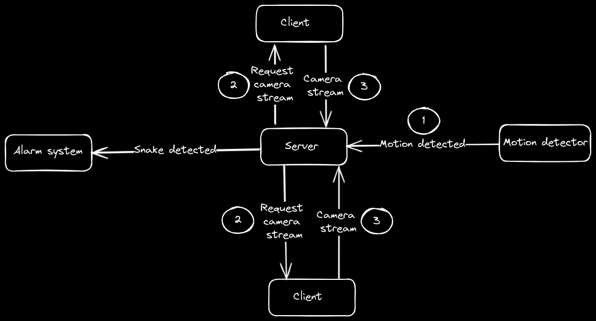

# Home security
## Idea
1. Use old phones as security camera for the house
2. Use camera stream to run object detection to look for poisonous animals (mainly snake)
## TODOs
1. Build a tcp sever to receive radar module messages and send camera stream requests to the phones ✅
2. Build a streaming client to receive camera streams from phones ✅ 
3. Build a phone app to send camera stream on demand
3. Train an AI model for inferencing and integrate the inferencing in the server ✅
4. Use a radar kit for movement detection (snakes cannot be captured on PIR sensors, they are cold blooded)
5. Send radar signals to the server
6. Based on radar signals ask the udp clients (phones) to send camera stream
## Architecture

### feature planing
1. Camera feed (Only video)
2. Add audio feed
3. Integrate calling bell
4. Human detection
5. Animal detection

